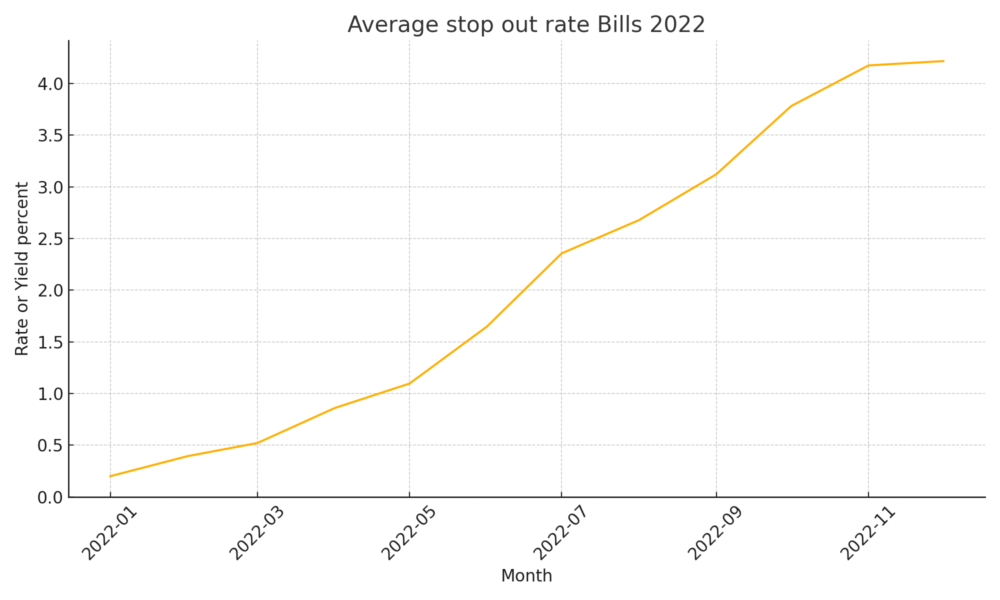
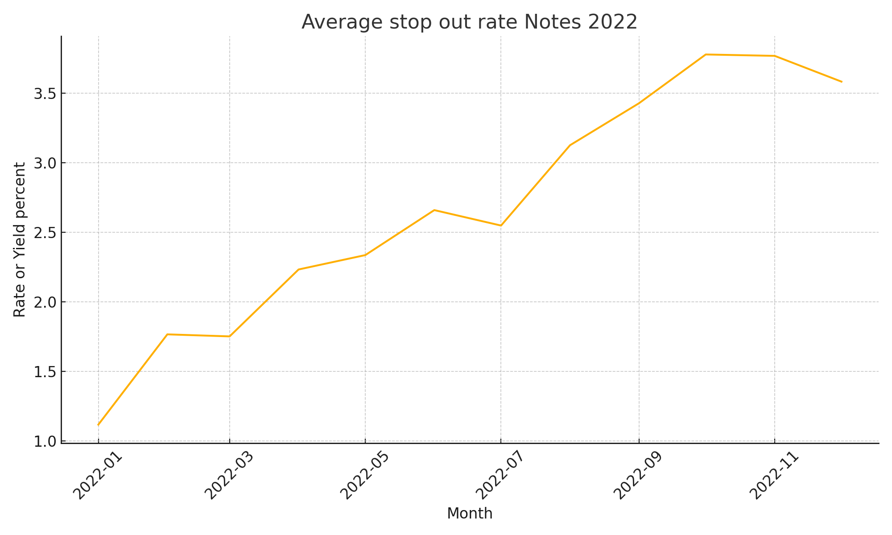
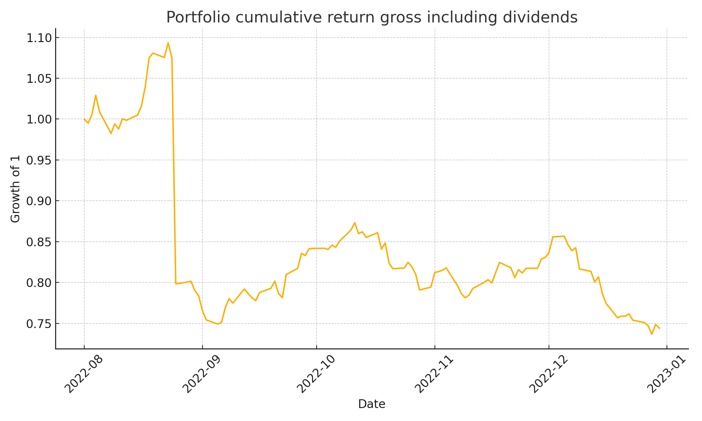

# Auction Microstructure and Equity Portfolio Analytics

I packaged two pieces of my work into a lean project. The goal is to show impact on both market microstructure and equity portfolio accounting.

## What this project delivers

1. Treasury auctions analytics for Bills and Notes in 2022
   I load official results from a local JSON snapshot, normalize fields, coerce types, highlight practical keys for merging, and produce tidy tables and figures
2. Equity portfolio accounting for a five name book in 2022H2
   I replay positions with explicit handling of splits and dividends, compute daily PnL and returns, and export a compact workbook and a cumulative return chart

## Quick start

```bash
python -m pip install -r requirements.txt
python scripts/run_auctions_pipeline.py
python scripts/run_portfolio_pipeline.py
```

## Visuals from the code

Auctions average stop out by month



Portfolio cumulative return



## Methods in one page

• Normalize the raw payload into a stable schema with cusip security_type security_term term_months auction_date issue_date maturity_date offering_amount total_tenders total_accepted bid_to_cover_ratio high_discount_rate high_yield price stop_out_rate

• Coerce dates and numerics and filter to Bills and Notes in calendar 2022

• Define term_months from tenor text for sorting and grouping

• Primary key candidates used in joins

  • cusip with auction_date
  
  • If cusip is missing then composite of security_type security_term auction_date issue_date
  
• Group by month and security_type then export summary series and plots

Portfolio

• Positions come from a small CSV with side and shares

• Prices come from a local Excel sheet with an optional Notes column for dividends

• Splits adjust shares forward from the split date so that market value is continuous

• Dividends apply as cash flows on the ex date with the correct sign for long and short

• Daily total return equals total PnL divided by prior day market value

## Reproducible outputs

Runs write artifacts into reports tables and figures so a reviewer can open results without running notebooks.

Auctions
• reports tables treasury_auctions_2022_parsed.csv
• reports tables treasury_auctions_2022_dtype_suggestions.json
• reports tables treasury_auctions_2022_key_suggestions.txt
• reports figures auction_avg_stop_out_bills_2022.png
• reports figures auction_avg_stop_out_notes_2022.png

Portfolio
• reports tables portfolio_daily_pnl.xlsx
• reports tables portfolio_eps_snapshots.csv
• reports tables portfolio_drivers.csv
• reports figures portfolio_cumulative_return_2022.png

